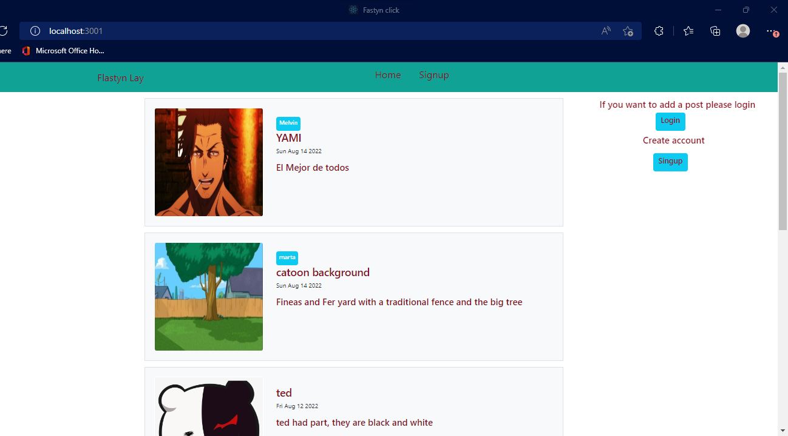
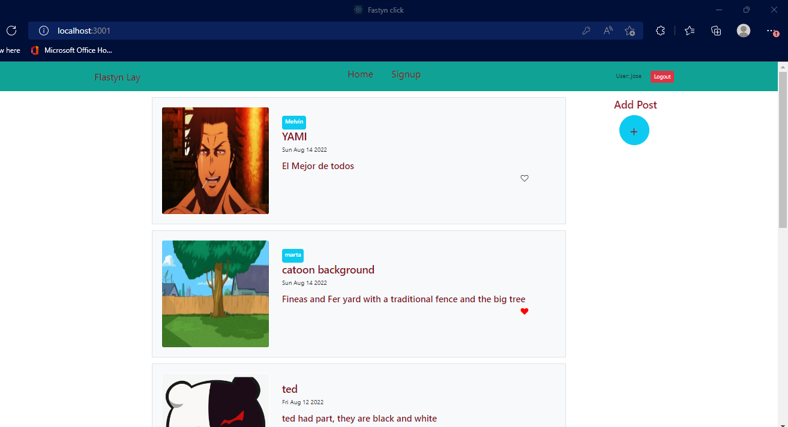
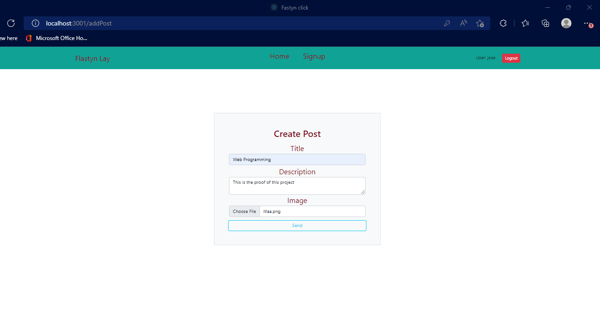
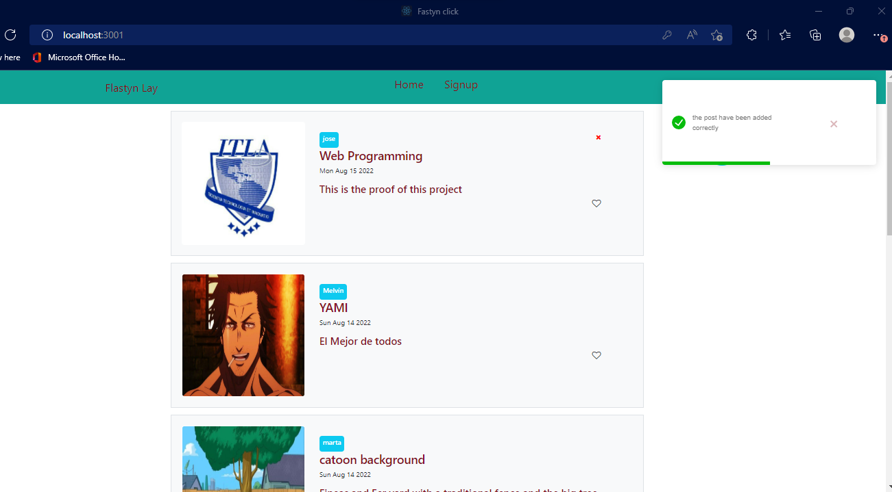

<h4>This is the final project by Jose Garcia 2019-9056</h4>

In the project directory, you can run:

### `npm start` or ### `yarn start`

Runs the app in the development mode.\
Open [http://localhost:3000](http://localhost:3000) to view it in your browser.

<h5>1-This is the Home page you most need to Login or SingUp</h5>

<h5>2-This is the page when the user is already logged in</h5>

<h5>2-This is the page of create post</h5>

<h5>2-This is the page showing the post already added</h5>

